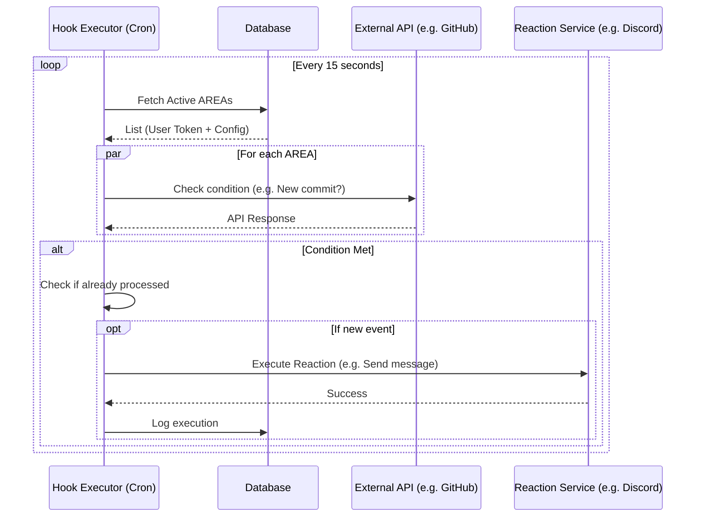

# AREA - Action REAction Platform

**Service Automation Platform (IFTTT/Zapier-like)** - Connect your favorite services to create powerful automated workflows.

A complete Epitech project including a Fastify backend API, a React + Vite web application, and a React Native mobile application.

## 📖 Project Description

AREA allows users to create custom automations by connecting different web services. Each automation (AREA) consists of:

- **Action** (trigger): An event that starts the automation
- **REAction**: An action that is executed in response

**Example**: "When I receive an email on Gmail (Action), send a Discord notification (REAction)"

## 🚀 Quick Start with Docker

```bash
# 1. Copy environment file
cp .env.example .env

# 2. Configure your OAuth credentials in .env
# Edit GOOGLE_CLIENT_ID, GITHUB_CLIENT_ID, DISCORD_CLIENT_ID, SPOTIFY_CLIENT_ID, etc.

# 3. Start all services
docker-compose up --build

# 4. Access the application
# Web: http://localhost:8081
# API: http://localhost:8080
# API Documentation: http://localhost:8080/documentation
# Mobile APK: http://localhost:8082/client.apk
```

## 📋 Implemented Features

### Available Services

| Service          | Actions (Triggers)                                  | REActions                                          | OAuth        |
| ---------------- | --------------------------------------------------- | -------------------------------------------------- | ------------ |
| **Gmail/Google** | • New email received                                | • Send an email                                    | ✅           |
| **GitHub**       | • New commit<br>• New issue<br>• New PR             | • Create an issue<br>• Comment on a PR             | ✅           |
| **Discord**      | • New message in channel                            | • Send message (webhook)<br>• Send private message | ✅           |
| **YouTube**      | • New video from channel                            | -                                                  | ✅           |
| **Spotify**      | • New liked song<br>• New playlist                  | • Add to playlist                                  | ✅           |
| **OpenWeather**  | • Temperature exceeds threshold<br>• Weather change | -                                                  | ❌ (API Key) |
| **Timer**        | • Every X minutes<br>• At specific time             | -                                                  | ❌           |

### Backend (Fastify + TypeScript + Prisma)

- ✅ PostgreSQL database with Prisma ORM
- ✅ Complete authentication:
  - Email/Password (JWT)
  - OAuth2 (Google, GitHub, Discord, Spotify)
  - Secure session management
- ✅ Full REST API for AREA management
- ✅ Hook Executor (automatic check every 15 seconds)
- ✅ Complete Swagger/OpenAPI documentation
- ✅ `/about.json` endpoint for mobile client
- ✅ OAuth token management with automatic refresh
- ✅ CORS configured for web and mobile

### Web Frontend (React + Vite + TypeScript)

- ✅ OAuth authentication (Google, GitHub, Discord, Spotify)
- ✅ AREA management interface (create, list, enable/disable, delete)
- ✅ Services page with available integrations list
- ✅ User dashboard with profile and linked accounts
- ✅ Responsive and modern design
- ✅ Real-time synchronization with backend
- ✅ Fully localized interface

### Mobile Application (React Native + Expo)

- ✅ Server configuration screen
- ✅ Complete OAuth authentication
- ✅ AREA management interface
- ✅ Service exploration
- ✅ Dashboard with statistics
- ✅ Modern UI with animations
- ✅ Android support (APK generated)
- ✅ Fully localized application

## 📂 Project Structure

```
.
├── server/                      # Fastify Backend (TypeScript)
│   ├── src/
│   │   ├── index.ts            # Server entry point
│   │   ├── routes.ts           # API routes with Swagger schemas
│   │   ├── swagger.config.ts   # Swagger/OpenAPI configuration
│   │   ├── services.config.ts  # AREA services configuration
│   │   ├── area.service.ts     # AREA business logic
│   │   ├── user.service.ts     # User management
│   │   ├── hook.executor.ts    # Automation engine
│   │   ├── actions/            # Action implementations
│   │   │   ├── gmail.action.ts
│   │   │   ├── github.action.ts
│   │   │   ├── discord.action.ts
│   │   │   ├── youtube.action.ts
│   │   │   ├── spotify.action.ts
│   │   │   ├── openweather.action.ts
│   │   │   └── timer.action.ts
│   │   └── reactions/          # Reaction implementations
│   │       ├── gmail.reaction.ts
│   │       ├── github.reaction.ts
│   │       ├── discord.reaction.ts
│   │       └── spotify.reaction.ts
│   ├── prisma/
│   │   └── schema.prisma       # Database schema
│   ├── Dockerfile
│   └── package.json
│
├── web/                         # React + Vite Frontend (TypeScript)
│   ├── src/
│   │   ├── pages/
│   │   │   ├── LandingPage.tsx
│   │   │   ├── LoginPage.tsx
│   │   │   ├── RegisterPage.tsx
│   │   │   ├── AreasPage.tsx
│   │   │   ├── ServicesPage.tsx
│   │   │   └── DashboardPage.tsx
│   │   ├── components/
│   │   └── App.tsx
│   ├── Dockerfile
│   ├── nginx.conf
│   └── package.json
│
├── mobile/                      # React Native Mobile Application
│   ├── app/
│   │   ├── (auth)/
│   │   │   ├── login.tsx
│   │   │   └── register.tsx
│   │   ├── (tabs)/
│   │   │   ├── index.tsx      # Dashboard
│   │   │   ├── areas.tsx      # AREA Management
│   │   │   ├── explore.tsx    # Services
│   │   │   └── profile.tsx    # User Profile
│   │   └── index.tsx          # Server Configuration
│   ├── Dockerfile
│   └── package.json
│
├── docker-compose.yml           # Complete orchestration
├── .env.example                 # Environment variables template
├── HOWTOCONTRIBUTE.md           # Guide to add new services
└── README.md                    # This file
```

## 🛠️ Installation and Development

### Prerequisites

- Node.js 20+
- Docker & Docker Compose (for containerized deployment)
- PostgreSQL 15+ (if running locally without Docker)

### Local Development (without Docker)

#### 1. Install dependencies

```bash
npm install
```

#### 2. Configure environment

```bash
cp .env.example .env
# Edit .env with your OAuth configurations
```

#### 3. Database configuration

```bash
cd server
npx prisma migrate deploy
npx prisma generate
```

#### 4. Start services

```bash
# Terminal 1: Backend server
cd server
npm run dev

# Terminal 2: Web application
cd web
npm run dev

# Terminal 3: Mobile application (optional)
cd mobile
npm start
```

### Development with Docker

```bash
# Build and start all services
docker-compose up --build

# Start in background
docker-compose up -d

# View logs
docker-compose logs -f server

# Stop all services
docker-compose down

# Rebuild a specific service
docker-compose up --build server
```

## 🔧 OAuth Configuration

### Google/Gmail

1. Access [Google Cloud Console](https://console.cloud.google.com/)
2. Create a new project
3. Enable Gmail API and YouTube Data API v3
4. Create OAuth 2.0 credentials
5. Add redirect URI: `http://localhost:8080/api/auth/gmail/callback`
6. Add scopes: `userinfo.email`, `userinfo.profile`, `gmail.readonly`, `gmail.send`, `youtube.readonly`

### GitHub

1. Go to Settings → Developer settings → OAuth Apps
2. Create a new OAuth App
3. Callback URL: `http://localhost:8080/api/auth/github/callback`
4. Scopes: `user:email`, `read:user`, `repo`

### Discord

1. Access the [Discord Developer Portal](https://discord.com/developers/applications)
2. Create a new application
3. OAuth2 → Add redirect: `http://localhost:8080/api/auth/discord/callback`
4. Scopes: `identify`, `email`

### Spotify

1. Go to [Spotify for Developers](https://developer.spotify.com/dashboard)
2. Create a new application
3. Add redirect URI: `http://localhost:8080/api/auth/spotify/callback`
4. Scopes: `user-library-read`, `playlist-modify-public`, `playlist-modify-private`

### OpenWeather

1. Sign up on [OpenWeatherMap](https://openweathermap.org/api)
2. Get a free API key
3. Add `OPENWEATHER_API_KEY` in `.env`

## 📱 Mobile Application

### Development

```bash
cd mobile
npm start
```

Use the Expo Go app to scan the QR code.

### APK Build

```bash
cd mobile
eas build --platform android --profile production
```

The APK is also available via Docker at `http://localhost:8082/client.apk`

## 📖 API Documentation

### Interactive Documentation

Complete Swagger documentation available at: **http://localhost:8080/documentation**

The documentation includes:

- All endpoints with detailed descriptions
- Request/response schemas
- Payload examples
- Error codes
- Bearer token authentication

### Main Endpoints

#### Health

- `GET /` - Welcome message
- `GET /health` - Server status
- `GET /about.json` - Service catalog (for mobile)

#### Authentication

- `POST /api/auth/register` - Create an account
- `POST /api/auth/login` - Email/password login
- `GET /api/auth/user` - Get logged-in user
- `POST /api/auth/logout` - Logout

#### OAuth

- `GET /api/auth/gmail` - Gmail/Google OAuth
- `GET /api/auth/github` - GitHub OAuth
- `GET /api/auth/discord` - Discord OAuth
- `GET /api/auth/spotify` - Spotify OAuth
- `GET /api/user/oauth-accounts` - List linked OAuth accounts
- `DELETE /api/user/oauth/:provider` - Disconnect OAuth account

#### AREAs (Automations)

- `GET /api/areas` - List user's AREAs
- `POST /api/areas` - Create a new AREA
- `PUT /api/areas/:id/toggle` - Enable/Disable an AREA
- `DELETE /api/areas/:id` - Delete an AREA

#### Services

- `POST /api/area/gmail/send_email` - Send an email
- `GET /api/github/repos` - List GitHub repositories

## 🏗️ Architecture

### Global Overview

The project follows a microservices-like architecture using Docker Compose.

```mermaid
graph TD
    subgraph Docker Network
        DB[(PostgreSQL)]
        Server[Backend Server<br/>(Node/Fastify)]
        Web[Web Client<br/>(React)]
        Mobile[Mobile APK Server<br/>(Nginx)]
    end

    UserMobile((Mobile App))
    UserWeb((Web Browser))

    %% User Flows
    UserWeb --Port 8081--> Web
    UserMobile --Port 8080--> Server
    Web --Port 8080--> Server

    %% Internal Flows
    Server --Read/Write--> DB
    Mobile --Shared Volume--> Web

    %% External Services
    Server --OAuth2 / API--> Google[Google API]
    Server --OAuth2 / API--> Github[GitHub API]
    Server --OAuth2 / API--> Discord[Discord API]
    Server --OAuth2 / API--> Spotify[Spotify API]
    Server --API Key--> Weather[OpenWeather]

    style Server fill:#f9f,stroke:#333,stroke-width:2px
    style DB fill:#bbf,stroke:#333,stroke-width:2px
```

### Database Schema

- **User**: User information and credentials
- **OAuthAccount**: OAuth tokens for external services
- **Session**: JWT sessions for authentication
- **Area**: Automation workflows (action + reaction)

### Hook Executor (Automation Engine)

The core business logic runs on a periodic interval to check for triggers.



1. Retrieves all active AREAs
2. For each AREA:
   - Checks if the action (trigger) is triggered
   - If yes, executes the corresponding reaction
   - Records the execution to avoid duplicates
3. Automatically handles OAuth token refresh when expired

### Adding New Services

See [HOWTOCONTRIBUTE.md](./HOWTOCONTRIBUTE.md) for a complete guide on adding new services, actions, and reactions.

## 🧪 Example Tests

### Test: Gmail → Discord

1. Connect with Gmail OAuth
2. Connect with Discord OAuth (or configure a webhook)
3. Create an AREA:
   - **Action**: Gmail - New email received
   - **REAction**: Discord - Send a message
   - Configure Discord webhook URL
4. Send an email to your Gmail address
5. **Result**: Within 15 seconds, Discord notification with email subject

### Test: GitHub → Discord

1. Connect with GitHub OAuth
2. Configure Discord webhook
3. Create an AREA:
   - **Action**: GitHub - New commit (specify repository)
   - **REAction**: Discord - Send a message
4. Make a commit to the specified repository
5. **Result**: Discord notification with commit details

### Test: Timer → Gmail

1. Connect with Gmail OAuth
2. Create an AREA:
   - **Action**: Timer - Every X minutes (e.g., 5 minutes)
   - **REAction**: Gmail - Send an email
   - Configure recipient, subject, and message body
3. Wait for the specified delay
4. **Result**: Automatic email sent

## 📦 Technologies Used

### Backend

- **Fastify** - Fast and lightweight web framework
- **TypeScript** - Static typing
- **Prisma** - Modern ORM for PostgreSQL
- **@fastify/swagger** - OpenAPI documentation
- **JWT** - Token-based authentication
- **OAuth2** - External service integration

### Web Frontend

- **React 18** - UI library
- **Vite** - Fast build tool
- **TypeScript** - Static typing
- **Tailwind CSS** - Utility-first CSS framework
- **Lucide React** - Modern icons

### Mobile

- **React Native** - Cross-platform mobile framework
- **Expo** - Toolchain and SDK
- **TypeScript** - Static typing
- **Expo Router** - File-based navigation

### DevOps

- **Docker** - Containerization
- **Docker Compose** - Multi-service orchestration
- **PostgreSQL** - Relational database
- **Nginx** - Web server for frontend

## 👥 Team

This project was developed by a team of 5 students at Epitech as part of the AREA project (T-DEV-500).

## 📄 License

This project is part of an Epitech school project.

## 🚀 Project Status

**Status**: ✅ Complete and functional project

**Features**:

- ✅ Complete backend API with authentication
- ✅ 7 integrated services (Gmail, GitHub, Discord, YouTube, Spotify, OpenWeather, Timer)
- ✅ 15+ implemented actions and reactions
- ✅ Responsive web application
- ✅ Android mobile application
- ✅ Complete Swagger API documentation
- ✅ Complete Docker deployment
- ✅ Fully localized user interface

---

For any questions or contributions, see [HOWTOCONTRIBUTE.md](./HOWTOCONTRIBUTE.md)
